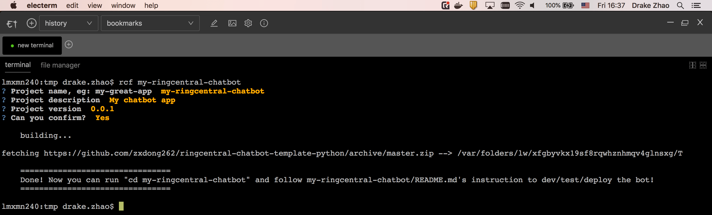

# [ringcentral-chatbot-factory-py](https://github.com/zxdong262/ringcentral-chatbot-factory-py)

Cli tool to generate RingCentral chatbot project.



## Use

```bash
# make sure you have python3/pip3 installed
pip3 install ringcentral_chatbot_factory

rcf my-app
# then carefully answer all questions, then the my-app folder will be created

cd my-app
# follow the instruction of my-app/README.md to dev/run/test/deploy the bot
```

## Templates

- [https://github.com/zxdong262/ringcentral-chatbot-template-python](https://github.com/zxdong262/ringcentral-chatbot-template-python)

## Example bot apps

- [date-time-chatbot](https://github.com/zxdong262/ringcentral-date-time-chatbot): simple Glip chatbot that can tell time/date.
- [assistant-bot](https://github.com/zxdong262/ringcentral-assistant-bot): simple assistant Glip bot to show user/company information, this bot will show you how to access user data.
- [survey-bot](https://github.com/zxdong262/ringcentral-survey-bot): example survey bot, this bot will show you how to create/use custom database wrapper.

## License

MIT
